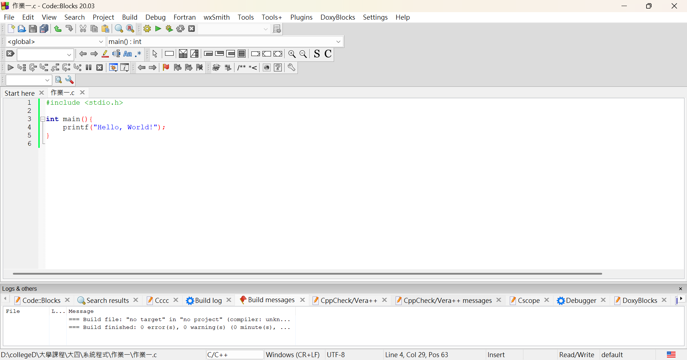
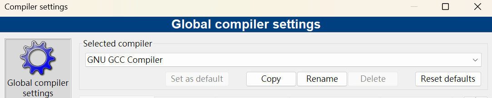
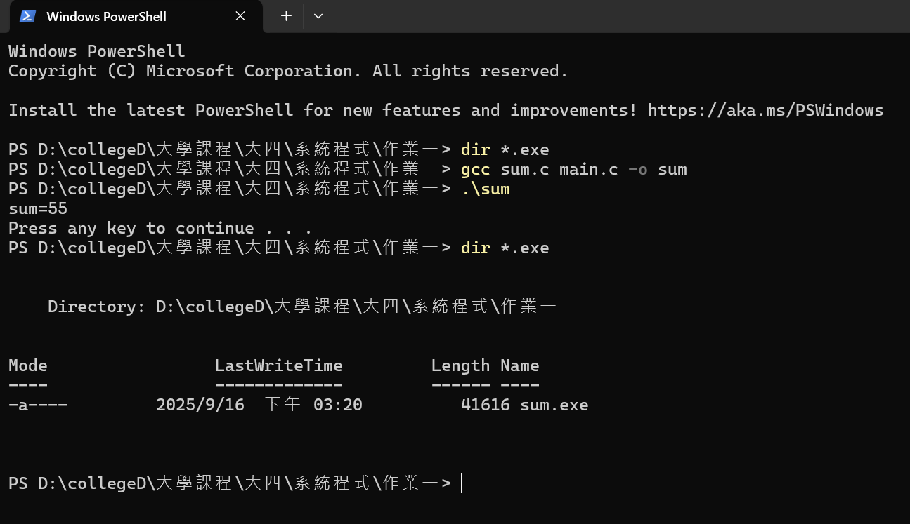

# 系統程式作業一 (2025/9/16)

---

## 第一題

**題目：** 之前寫 C 程式是在哪一個作業系統？哪一個 IDE？（例：Dev-C++、Code::Blocks、VS、Xcode、VS Code、其他）

> 答案：Code::Blocks

---

## 第二題

**題目：** IDE 背後實際呼叫的是哪個編譯器？（例：MinGW gcc、TDM-GCC、MSVC cl.exe、Clang、Linux gcc、其他）

> 答案：GNU GCC Compiler

---

## 第三題

**題目：** 使用 Command Line 的方式呼叫編譯器進行範例程式編譯，以截圖呈現作答。

> 答案：

---
