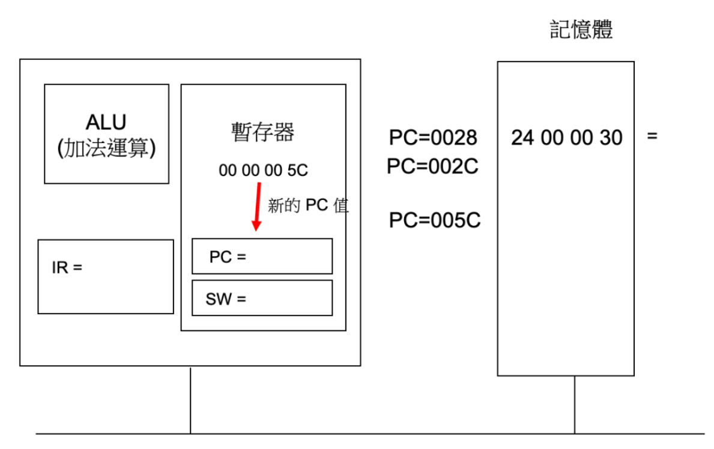
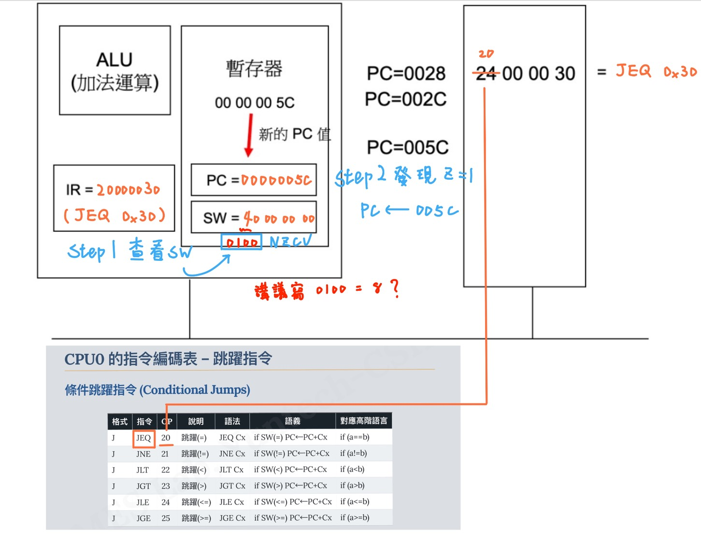
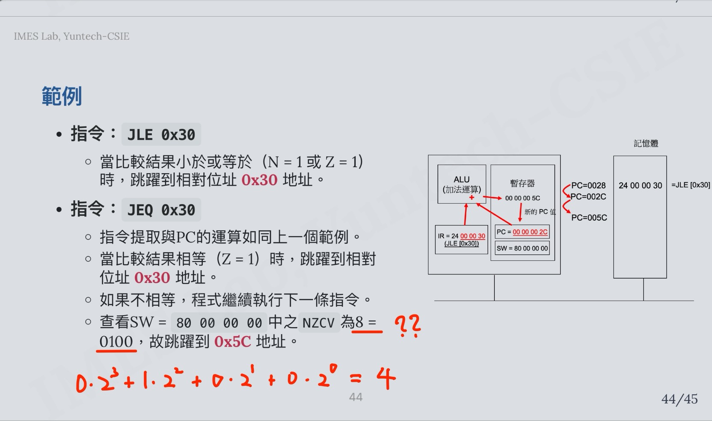
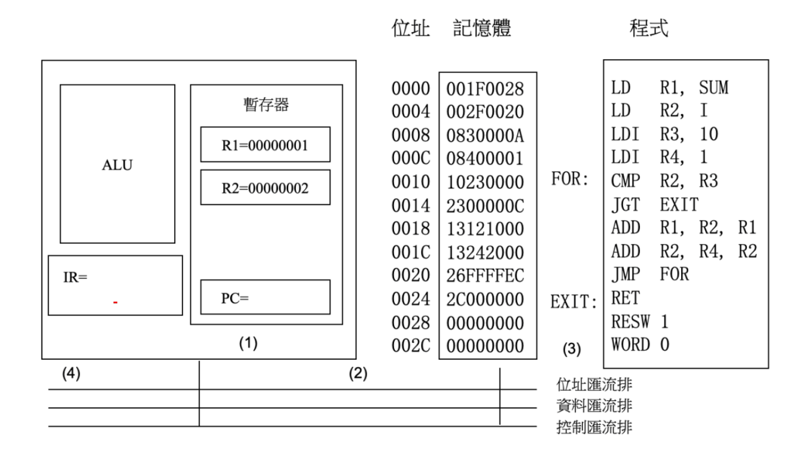
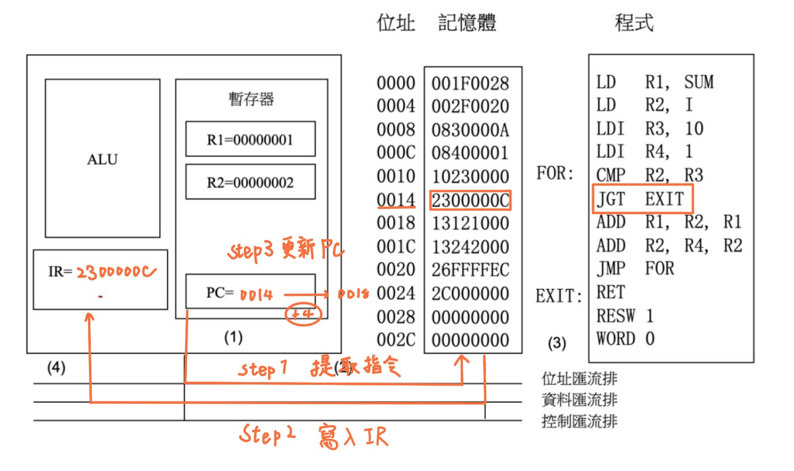
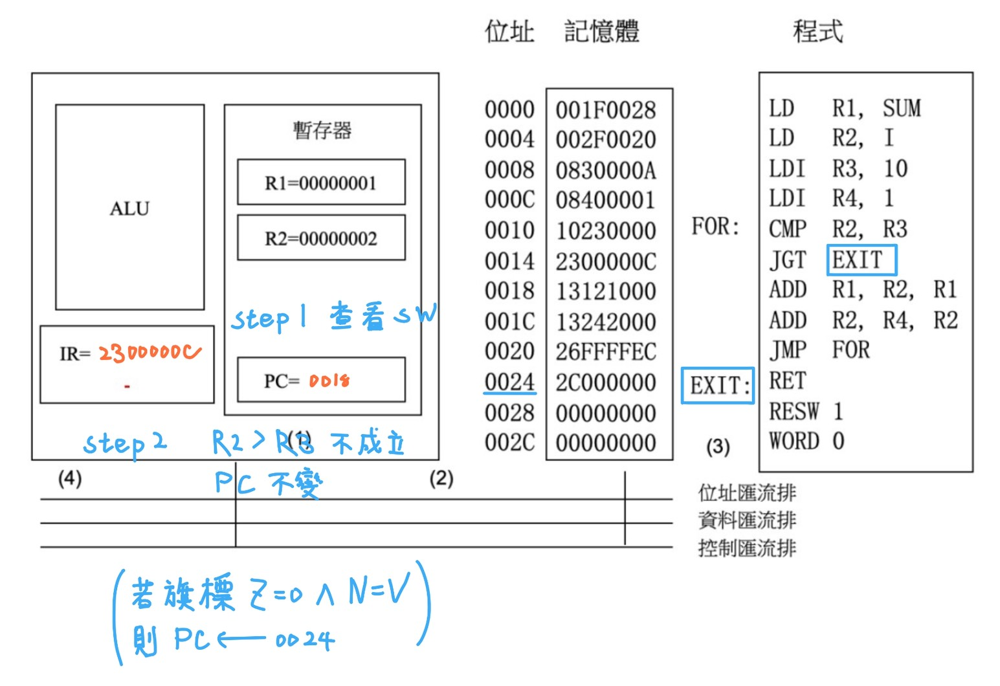

# 作業二 第二章習題

## 2.1 

### 2.1.1 請問 CPUO 有哪些暫存器？並說明這些暫存器的功能？

| 暫存器 | 全名 | 功能 |
| - | - | - |
| SW | Status Word | 讓 CPU 判斷上一次運算結果與當前狀態。 |
| SP | Stack Pointer Register | 維護 Stack 資料結構，Stack 用於暫存資料。 |
| LR | Link Register | 儲存程式呼叫的返回位址。 |
| PC | Program Counter | 儲存下一個要執行指令的記憶體位址。 |
| IR | Instruction Register | 儲存目前正在執行的指令內容，CPU 會將 IR 的內容解碼 (decode) 並執行。 |
| MAR | Memory Address Register | 儲存要讀取或寫入記憶體的位址。 |
| MDR | Memory Data Register | 儲存從記憶體讀取或要寫入記憶體的資料。 |

---

## 2.3

### 2.3.1 當以下條件跳躍指令成⽴時的狀態暫存器條件旗標為何? 以(N, Z, C, V)表⽰。

| 指令 | 判斷條件 | 成立時的旗標狀態 | 說明 |
| :- | :- | :- | :- |
| **JEQ** (Jump if Equal) | Z = 1 | (N, **Z=1**, C, V) | A = B |
| **JNE** (Jump if Not Equal) | Z = 0 | (N, **Z=0**, C, V) | A ≠ B |
| **JGT** (Jump if Greater Than) | (Z = 0) 且 (N = V) | (**N=V**, **Z=0**, C, V) | A > B |
| **JLT** (Jump if Less Than) | N ≠ V | (**N≠V**, Z, C, V) | A < B |
| **JLE** (Jump if Less or Equal) | (Z = 1) 或 (N ≠ V) | (**Z=1 或 N≠V**, C, V) | A ≤ B |

> 補充

|   旗標  | 意義                       |
| :---: | :----------------------- |
| **N** | Negative flag：結果為負數時設為 1 |
| **Z** | Zero flag：結果為 0 時設為 1    |
| **C** | Carry flag：無號運算時的進位／借位   |
| **V** | Overflow flag：有號運算時的溢位   |

---

### 2.3.2 畫出下列指令執行流程圖 (未完成)

- 指令：JEQ 0x30

(當比較結果相等（Z = 1）時，跳躍到 0x30 地址；如果不相等，程式繼續執行下一條指令)



答：



講義錯誤：



---

### 2.3.3

由於 **JMP 指令** 的位址欄位大小為 **24 位元**，在 **CPU0** 當中，由於我們使用了有正負號的二補數表示法，因此合法的跳躍範圍被限制在 PC - 2^23  ～  PC + 2^23 - 1 之間。  
**如果我們想要跳躍的位址不在這個範圍之內，可以怎麼做？**

答：可以使用多段跳躍：

```bash
MAIN:
    JMP MID_JUMP
...

MID_JUMP:
    JMP TARGET_LABEL
```

---

### 2.3.4 相對定址法與索引定址法二者都適用於存取結構化資料，二者的差別是什麼？請舉例來說明，其差異與適用之條件。

- **相對定址法**  
  常用於結構資料型態(可能含有整數與字串)，能更靈活的決定地址位置，但用不好容易出錯。

  範例：`LD R1, [R2+100]` → 取結構中固定欄位。  

- **索引定址法**  
  常用於陣列索引，能提前設定好一個元素單位元組數(以4-bytes整數為例)，操作方便。

  範例：`LDR R1, [R2+R3*4]` → 取陣列中第 R3 個元素。  

- **差別**：相對定址偏移固定，索引定址偏移可變。  
- **用途**：相對定址常用於結構；索引定址常用於陣列。

### 2.3.5 請問 CPUO 當中有哪些定址方式，並以範例加以說明？

|定址法|範例|說明|
|-|-|-|
| **立即載入法 (Immediate Addressing Mode)** | `LDI R1, 100` | 將數值100直接載入暫存器R1中。 |
| **相對定址法 (Relative Addressing Mode)** | `LD R1, [R2+100]` | 從記憶體中取得R2位址加上100偏移量的資料。 |
| **索引定址法 (Indexed Addressing Mode)** | `LDR R1, [R2+R3]` | 將基底暫存器R2與索引暫存器R3的和作為位址，載入對應位址的資料到R1中。 |
| **絕對定址法 (Absolute Addressing Mode)** | `LD R1, [R0+100]` | 因為R0恆為0，此操作相當於直接存取位址 100 的記憶體內容 |

---

## 2.4

### 2.4.1 依據此圖，假如目前的 PC = 00000014，指令將如何提取與執行？請分別依指令提取階段與指令執行階段畫圖並說明執行過程。



答：

- 提取階段



- 執行階段



---

## 2.5

### 2.5.1 為什麼 80286 採用了「區段 + 位移」的組合方式，就可以讓 80286 可以定址到 1MB 的記憶體空間？

- 公式： `實際位址 = 區段位址 * 16 + 位移值`
- 說明：相當於將16 bits的區段位置左移4 bit，並由16 bits的位移值來表示，這樣一來**實體位址共20 bits**，`2^20 = 1,048,575` 便可定址 1MB 的記憶體空間。
