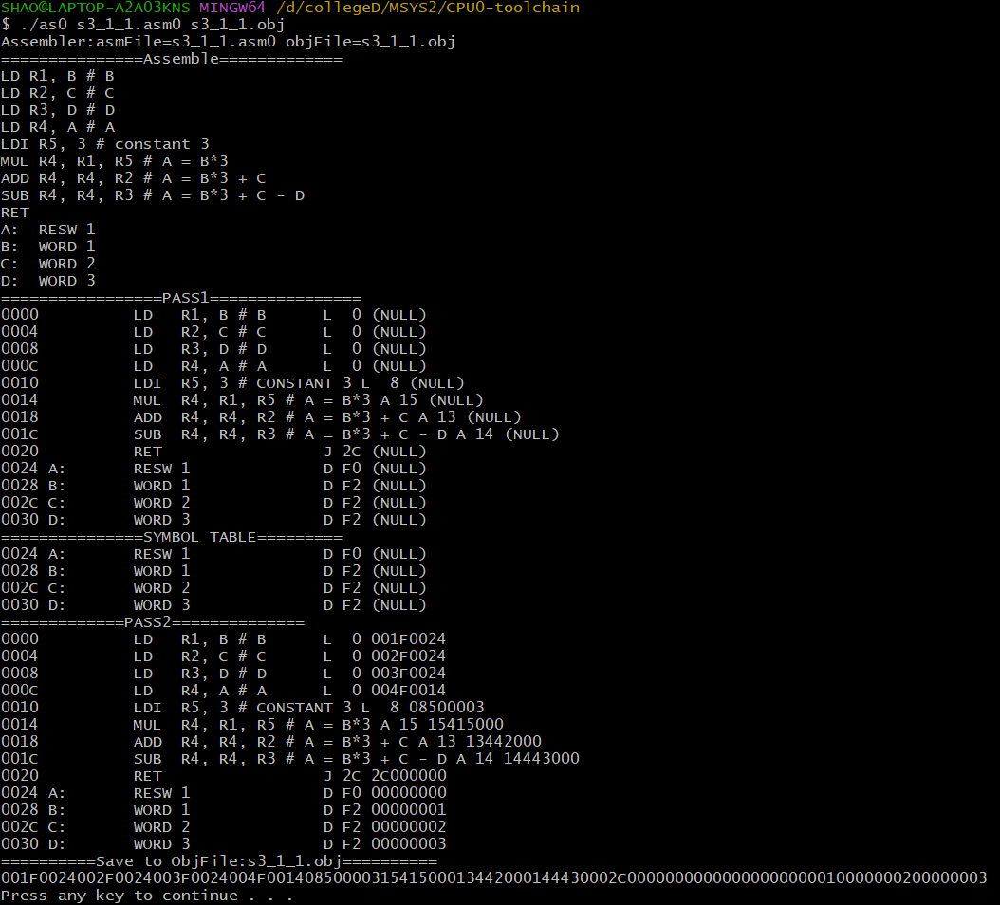
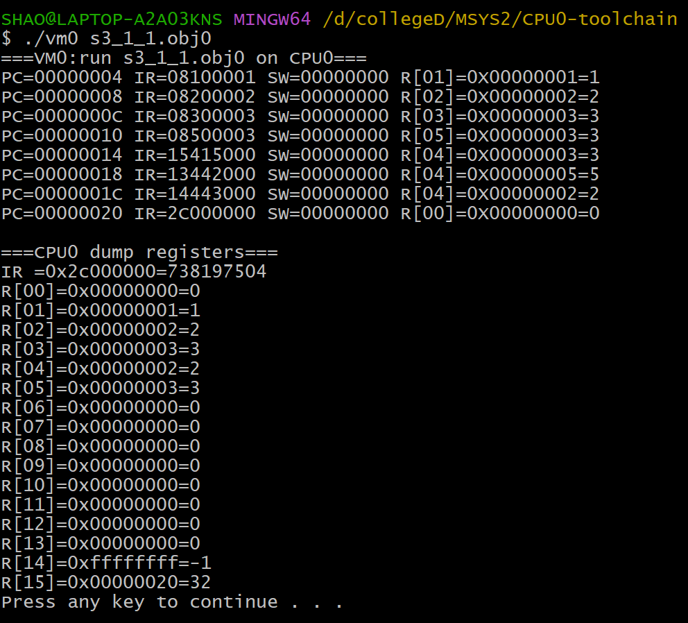
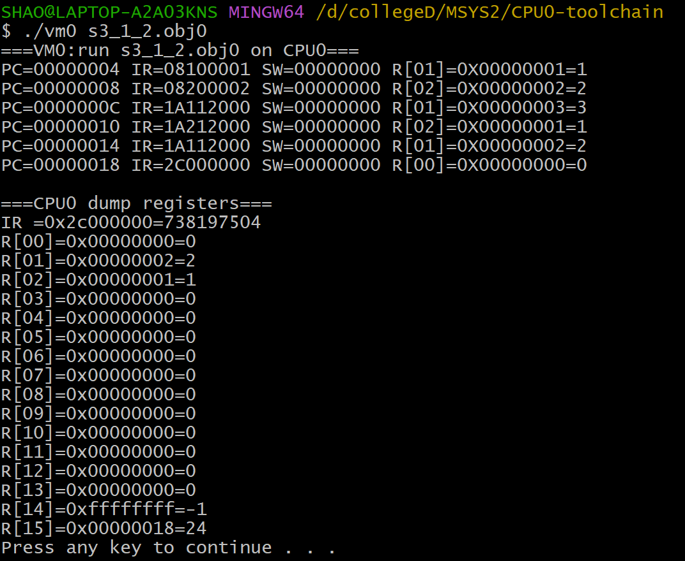
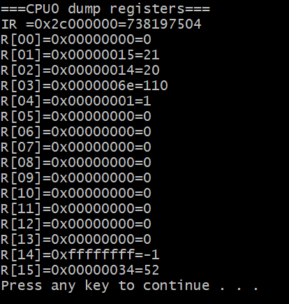

# 作業四

## 請寫出一個 CPU 的組合語言程式，可以計算 a=b*3+c-d 的算式；自行設定 b, c, d 數值，先載入數值後，再開始運算。

> 以 b=1, c=2, d=3 為例

程式碼：

```asm
LD R1, B # B
LD R2, C # C
LD R3, D # D
LD R4, A # A
LDI R5, 3 # constant 3
MUL R4, R1, R5 # A = B*3
ADD R4, R4, R2 # A = B*3 + C
SUB R4, R4, R3 # A = B*3 + C - D
RET
A:  RESW 1
B:  WORD 1
C:  WORD 2
D:  WORD 3
```

執行Assembler結果：



執行Virtual machine結果：



## 請寫出一個 CPU 的組合語言 swap，可以將暫存器 R1 與 R2 的內容交換。先載入自行設定常數值後，再開始執行交換。

> 以 R1=1, R2=2 為例 **(使用超酷的XOR方法，可以不需要第三個暫存器)**

程式碼：

```asm
LDI R1, 1 
LDI R2, 2 

XOR R1, R1, R2 # R1= 1^2
XOR R2, R1, R2 # R2= 1^2^2 = 1
XOR R1, R1, R2 # R1= 1^2^1 = 2

RET
```

執行Assembler結果：


執行Virtual machine結果：



## 請使用 CPU 的組合語言，撰寫一個組合語言程式，計算 1 到 20 的偶數和。

```asm
LDI R1, 1 # I
LDI R2, 20 # SIZE
LDI R3, 0 # ANSWER
LDI R4, 1 # CONSTANT 1
FOR:    CMP R1, R2 # EXIT OR NOT
        JGT EXIT

        AND R5, R1, R4 # IS ODD OR NOT
        CMP R5, R0
        JGT SKIP # IS ODD -> SKIP

        ADD R3, R3, R1 # R3 += I
SKIP:   ADD R1, R1, R4 # I++
        JMP FOR
        
EXIT:   RET
```

執行Assembler結果：


執行Virtual machine結果：


