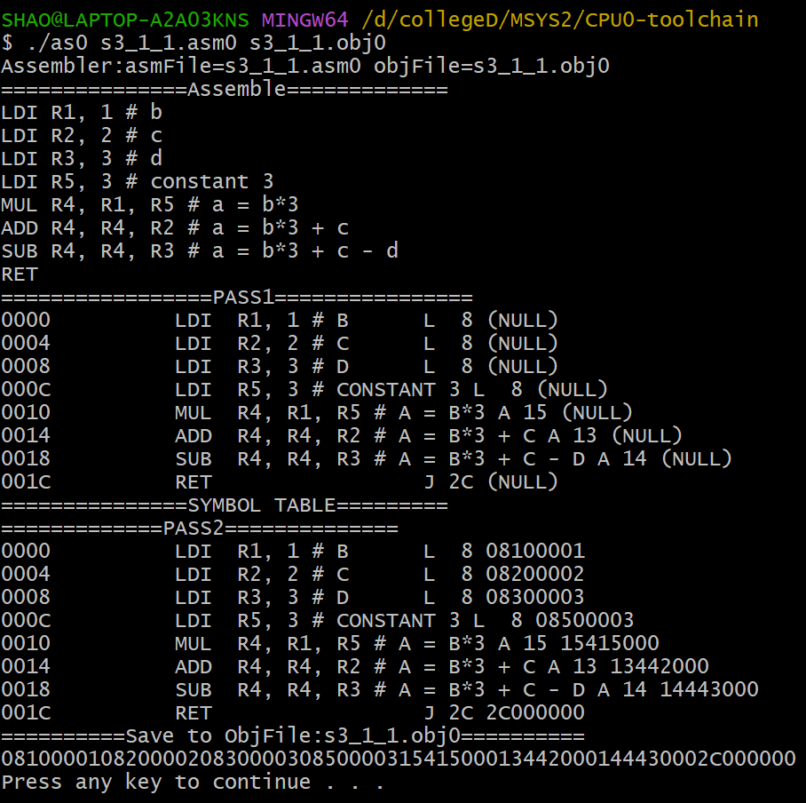
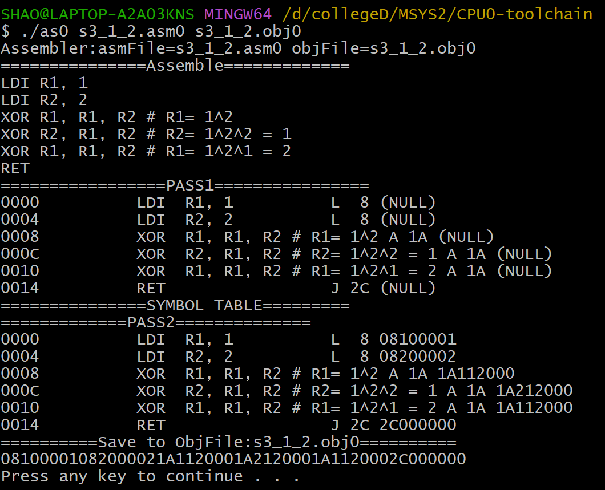
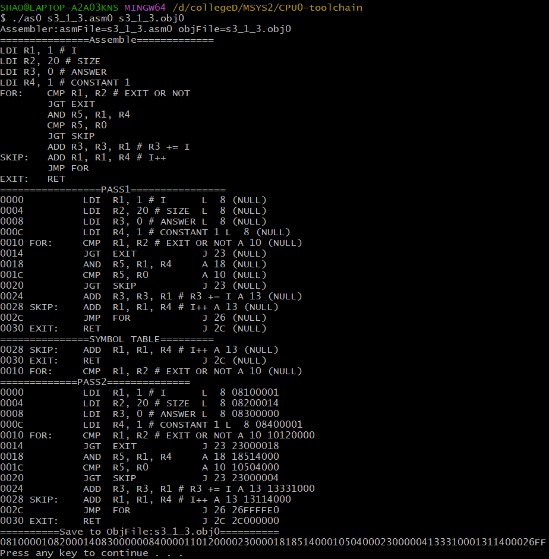

# 作業三

## 請寫出一個 CPU 的組合語言程式，可以計算 a=b*3+c-d 的算式；自行設定 b, c, d 數值，先載入數值後，再開始運算。

> 以 b=1, c=2, d=3 為例

程式碼：

```asm
LDI R1, 1 # b
LDI R2, 2 # c
LDI R3, 3 # d
LDI R5, 3 # constant 3
MUL R4, R1, R5 # a = b*3
ADD R4, R4, R2 # a = b*3 + c
SUB R4, R4, R3 # a = b*3 + c - d
RET
```

編譯結果：



執行結果：


## 請寫出一個 CPU 的組合語言 swap，可以將暫存器 $R1$ 與 $R2$ 的內容交換。先載入自行設定常數值後，再開始執行交換。

> 以 R1=1, R2=2 為例 **(使用超酷的XOR方法，可以不需要第三個暫存器)**

程式碼：

```asm
LDI R1, 1 
LDI R2, 2 

XOR R1, R1, R2 # R1= 1^2
XOR R2, R1, R2 # R2= 1^2^2 = 1
XOR R1, R1, R2 # R1= 1^2^1 = 2

RET
```

編譯結果：



執行結果：


## 請使用 CPU 的組合語言，撰寫一個組合語言程式，計算 $1$ 到 $20$ 的偶數和。

```asm
LDI R1, 1 # I
LDI R2, 20 # SIZE
LDI R3, 0 # ANSWER
LDI R4, 1 # CONSTANT 1
FOR:    CMP R1, R2 # EXIT OR NOT
        JGT EXIT

        AND R5, R1, R4 # IS ODD OR NOT
        CMP R5, R0
        JGT SKIP # IS ODD -> SKIP

        ADD R3, R3, R1 # R3 += I
SKIP:   ADD R1, R1, R4 # I++
        JMP FOR
        
EXIT:   RET
```

編譯結果：



執行結果：


