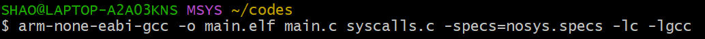
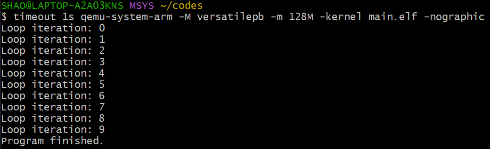
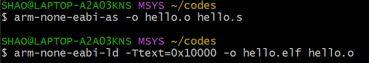
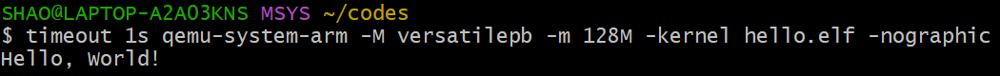
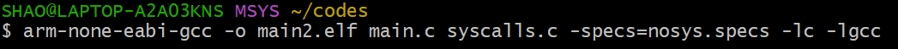
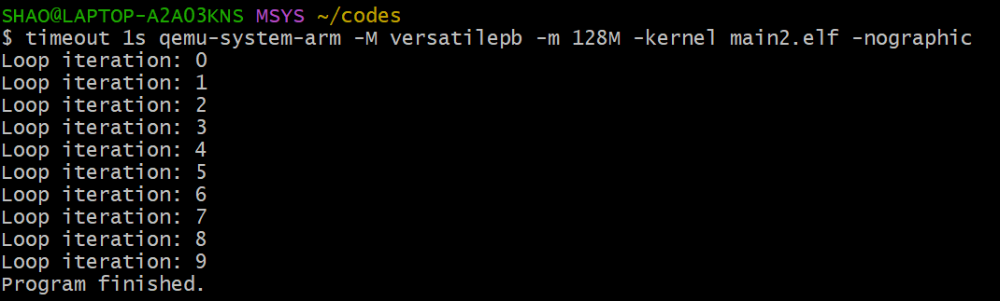
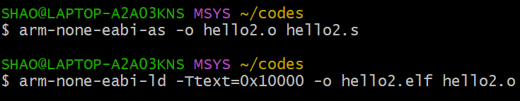
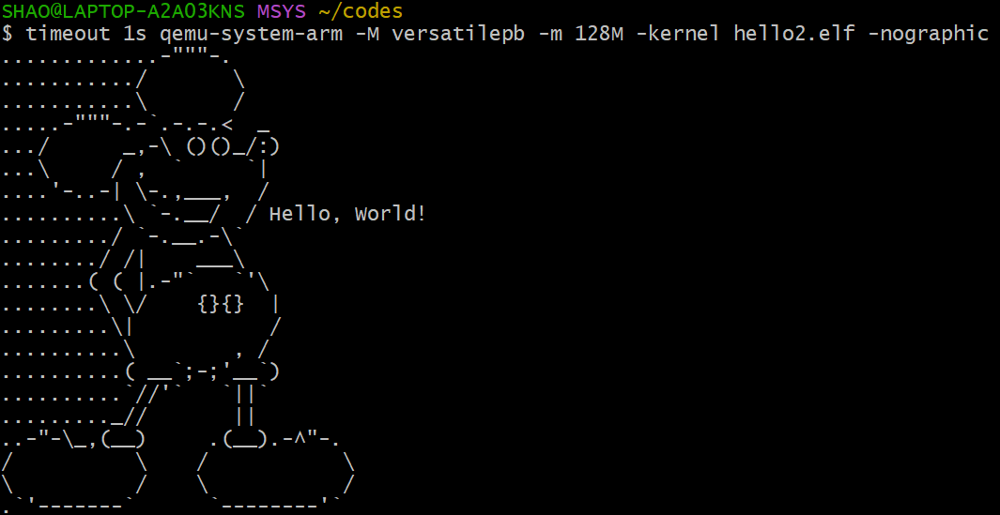

# 作業五

## 範例 ARM C程式

```c
#include <stdio.h>
int main(){
    int i;
    for(i=0;i<10;i++){
        printf("Loop iteration: %d\n",i);
    }
    printf("Program finished.\n");
    return 0;
}
```

- 編譯指令

```shell
arm-none-eabi-gcc -o main.elf main.c syscalls.c -specs=nosys.specs -lc -lgcc
```



- QEMU模擬程式

```shell
timeout 1s qemu-system-arm -M versatilepb -m 128M -kernel main.elf -nographic
```



### 範例 ARM 組合語言程式

```asm
.section .data
msg:
    .asciz "Hello, World!\n"

.section .text
.global _start

// Base address of the UART0
.equ UART0, 0x101f1000

_start:
    ldr r1, =msg        // 將訊息地址載入 r1
    bl print_string     // 呼叫輸出函數

// 結束程式
b .

print_string:
    ldrb r2, [r1], #1   // 每次從 r1 (msg) 中讀取一個字元到 r2
    cmp r2, #0          // 檢查是否到字串結尾
    beq end_string      // 如果是 0 (字串結尾)，跳轉到 end_string

// 等待 UART 傳輸可用
wait_uart:
    ldr r3, =UART0      // 設定 UART 地址
    ldr r4, [r3, #0x18] // 讀取 UARTFR (Flag Register)
    tst r4, #0x20       // 檢查 TXFF (Transmit FIFO Full)，若為 1 則等待
    bne wait_uart

// 發送字元
    str r2, [r3, #0x00] // 寫入字元到 UARTDR (Data Register)
    b print_string      // 迴圈繼續發送字串中下一個字元

end_string:
    bx lr               // 返回
```

- 組譯指令

```shell
arm-none-eabi-as -o hello.o hello.s
arm-none-eabi-ld -Ttext=0x10000 -o hello.elf hello.o
```



- QEMU模擬程式

```shell
timeout 1s qemu-system-arm -M versatilepb -m 128M -kernel hello.elf -nographic
```



## 自訂 ARM C程式

```c
#include <stdio.h>
void f(int i){
    if(i<0)
        return;
    f(i-1);
    printf("Loop iteration: %d\n",i);
    return;
}
int main(){
    int i;
    f(9);
    printf("Program finished.\n");
    return 0;
}
```

- 編譯指令

```shell
arm-none-eabi-gcc -o main2.elf main.c syscalls.c -specs=nosys.specs -lc -lgcc
```



- QEMU模擬程式

```shell
timeout 1s qemu-system-arm -M versatilepb -m 128M -kernel main2.elf -nographic
```



### 自訂 ARM 組合語言程式

```asm
.section .data
msg:
    .asciz ".............-\"\"\"-.\n.........../       \\\n...........\\       /\n.....-\"\"\"-.-`.-.-.<  _\n.../      _,-\\ ()()_/:)\n...\\     / ,  `     `|\n....'-..-| \\-.,___,  /\n..........\\ `-.__/  / Hello, World!\n........./ `-.__.-\\`\n......../ /|    ___\\\n.......( ( |.-\"`   `'\\\n........\\ \\/    {}{}  |\n.........\\|           /\n..........\\        , /\n..........( __`;-;'__`)\n..........`//'`   `||`\n........._//       ||\n..-\"-\\_,(__)     .(__).-^\"-.\n/          \\    /           \\\n\\          /    \\           /\n.`'-------`      `--------'`"
.section .text
.global _start

// Base address of the UART0
.equ UART0, 0x101f1000

_start:
    ldr r1, =msg        // 將訊息地址載入 r1
    bl print_string     // 呼叫輸出函數

// 結束程式
b .

print_string:
    ldrb r2, [r1], #1   // 每次從 r1 (msg) 中讀取一個字元到 r2
    cmp r2, #0          // 檢查是否到字串結尾
    beq end_string      // 如果是 0 (字串結尾)，跳轉到 end_string

// 等待 UART 傳輸可用
wait_uart:
    ldr r3, =UART0      // 設定 UART 地址
    ldr r4, [r3, #0x18] // 讀取 UARTFR (Flag Register)
    tst r4, #0x20       // 檢查 TXFF (Transmit FIFO Full)，若為 1 則等待
    bne wait_uart

// 發送字元
    str r2, [r3, #0x00] // 寫入字元到 UARTDR (Data Register)
    b print_string      // 迴圈繼續發送字串中下一個字元

end_string:
    bx lr               // 返回
```

- 組譯指令

```shell
arm-none-eabi-as -o hello2.o hello2.s
arm-none-eabi-ld -Ttext=0x10000 -o hello2.elf hello2.o
```



- QEMU模擬程式

```shell
timeout 1s qemu-system-arm -M versatilepb -m 128M -kernel hello2.elf -nographic
```


